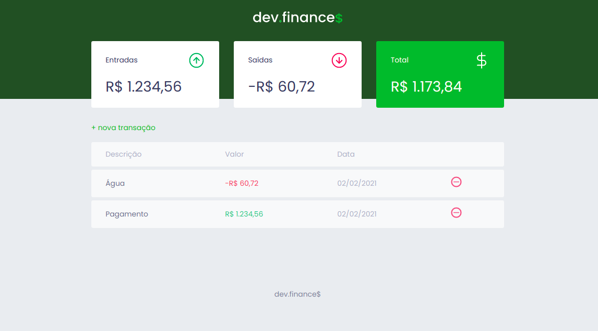
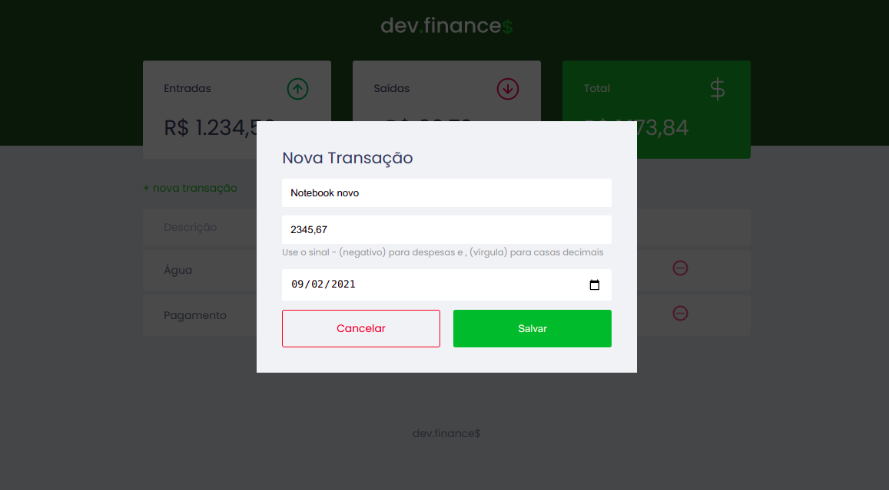
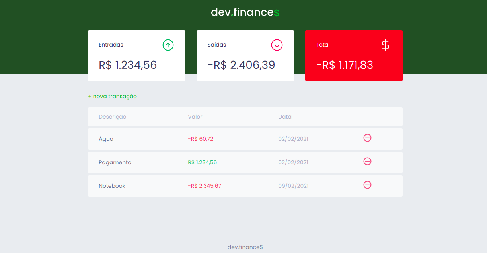

# Dev.finance$
Projeto criado na Maratona Discovery, ministrada pela Rocketseat

O projeto consiste em um app web (feito em HTML, css e javascript) para cadastro de despesas e recibos. Todos os dados são salvos no [localStorage](https://developer.mozilla.org/pt-BR/docs/Web/API/Window/Window.localStorage) do navegador.

## Screenshots

Que tal dar uma olhada em como o projeto ficou?

